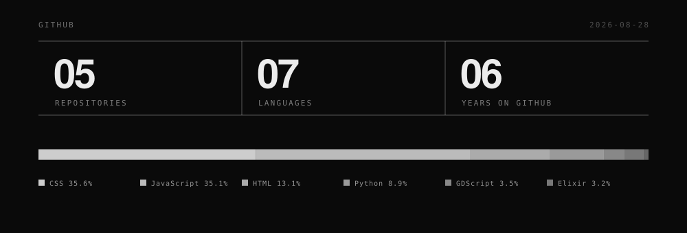

<!-- Each block sits in its own 
. A bare  gets wrapped by GitHub in an
     inline <a>, which carries no margin, so without this the blocks collapse
     to a 2px gap. The   adds the air a 16px paragraph margin alone misses. -->

 

  
  &nbsp;
  

 

